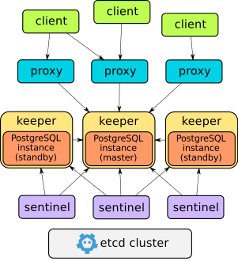

# stolon - PostgreSQL cloud native High Availability

[](https://run.agola.io/org/stolon/projects/stolon.proj)
[](https://talk.stolon.io)
[](https://goreportcard.com/report/github.com/sorintlab/stolon)
[](https://github.com/sorintlab/stolon/releases)
[](https://github.com/sorintlab/stolon/releases)


stolon is a cloud native PostgreSQL manager for PostgreSQL high availability. It's cloud native because it'll let you keep an high available PostgreSQL inside your containers (kubernetes integration) but also on every other kind of infrastructure (cloud IaaS, old style infrastructures etc...)

For an introduction to stolon you can also take a look at [this post](https://sgotti.me/post/stolon-introduction/)

## Features

* Leverages PostgreSQL streaming replication.
* Resilient to any kind of partitioning. While trying to keep the maximum availability, it prefers consistency over availability.
* [kubernetes integration](examples/kubernetes/README.md) letting you achieve postgreSQL high availability.
* Uses a cluster store like [etcd](https://etcd.io), [consul](https://www.consul.io) or kubernetes API server as an high available data store and for leader election
* Asynchronous (default) and [synchronous](doc/syncrepl.md) replication.
* Full cluster setup in minutes.
* Easy [cluster administration](doc/stolonctl.md)
* Can do point in time recovery integrating with your preferred backup/restore tool.
* [Standby cluster](doc/standbycluster.md) (for multi site replication and near zero downtime migration).
* Automatic service discovery and dynamic reconfiguration (handles postgres and stolon processes changing their addresses).
* Can use [pg_rewind](doc/pg_rewind.md) for fast instance resynchronization with current master.

## Architecture

Stolon is composed of 3 main components

* keeper: it manages a PostgreSQL instance converging to the clusterview computed by the leader sentinel.
* sentinel: it discovers and monitors keepers and proxies and computes the optimal clusterview.
* proxy: the client's access point. It enforce connections to the right PostgreSQL master and forcibly closes connections to old masters.

For more details and requirements see [Stolon Architecture and Requirements](doc/architecture.md)



## Documentation

[Documentation Index](doc/README.md)

## Installation

Stolon is available in [brew](https://brew.sh/). It is **unofficial and not supported** by the project.
So check the version before installing using `brew`.

[Step to install using brew](doc/unofficial_packages.md)

## Quick start and examples

* [Simple cluster example](doc/simplecluster.md)
* [Kubernetes example](examples/kubernetes/README.md)
* [Two (or more) nodes setup](doc/twonodes.md)

## Project Status

Stolon is under active development and used in different environments. Probably its on disk format (store hierarchy and key contents) will change in future to support new features. If a breaking change is needed it'll be documented in the release notes and an upgrade path will be provided.

Anyway it's quite easy to reset a cluster from scratch keeping the current master instance working and without losing any data.

## Requirements

* PostgreSQL 12, 11, 10 or 9 (9.4, 9.5, 9.6)
* etcd2 >= v2.0, etcd3 >= v3.0, consul >= v0.6 or kubernetes >= 1.8 (based on the store you're going to use)

* OS: currently stolon is tested on GNU/Linux (with reports of people using it also on Solaris, *BSD and Darwin)

## build

To build stolon we usually test and support the latest two major versions of Go like in the [Go release policy](https://golang.org/doc/devel/release.html#policy).

```
make
```

## High availability

Stolon tries to be resilient to any partitioning problem. The cluster view is computed by the leader sentinel and is useful to avoid data loss (one example over all avoid that old dead masters coming back are elected as the new master).

There can be tons of different partitioning cases. The primary ones are covered (and in future more will be added) by various [integration tests](tests/integration)

## FAQ

See [here](doc/faq.md) for a list of faq. If you have additional questions please ask.

## Contributing to stolon

stolon is an open source project under the Apache 2.0 license, and contributions are gladly welcomed!
To submit your changes please open a pull request.

## Contacts

* For general discussion about using and developing stolon, join the [stolon forum](https://talk.stolon.io)
* For bugs and feature requests file an [issue](https://github.com/sorintlab/stolon/issues/new/choose)
