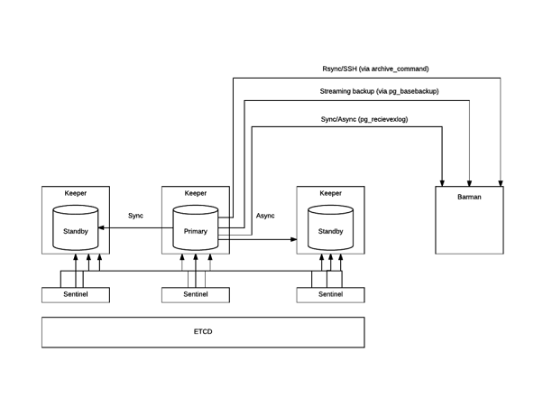

## Point in time recovery with Barman

[Barman](http://www.pgbarman.org) (Backup and Recovery Manager) is an open-source administration tool for disaster recovery of PostgreSQL servers.

This example shows how to integrate Barman [Barman](http://www.pgbarman.org) with Stolon. Therefore, by integrating Barman with Stolon,
you can dramatically reduce RTO(Recovery Time Objective) and RPO(Recovery Point Objective) to nearly zero values.

### Introduction

Offers two options for backup and archiving. Traditionally, Barman has supported standard WAL file shipping through
PostgreSQL’s `archive_command` (usually via `rsync/SSH`). With this method, WAL files are archived only when PostgreSQL switches to a new WAL file.
To keep it simple, this normally happens every 16 MB worth of data changes. Barman also introduces streaming of WAL files for PostgreSQL 9.2 or later,
as an additional method for transactional log archiving through `pg_receivexlog`. WAL streaming is able to reduce the risk of data loss,
bringing RPO down to nearly zero values. In addition, Barman introduces support for replication slots with PostgreSQL servers 9.4 or later, therefore allowing WAL streaming-only configurations.
Moreover, you can now add Barman as a synchronous WAL receiver in your PostgreSQL 9.5 (or later) cluster and achieve zero data loss (RPO=0).
Thus, the traditional archiving of WAL logs can lead to data loss in the event of an accident.

### Possible solution for integration of Stolon with Barman



For integration of  Stolon with Barman, you can use scenarios for backup via streaming protocol.

In this scenario, you will need to configure:

- A standard connection to PostgreSQL for management, coordination, and monitoring purposes,
- A streaming replication connection that will be used by both pg_basebackup (for base backup operations) and pg_receivexlog (for WAL streaming)
This setup, in Barman’s terminology, is known as streaming-only setup, as it does not require any SSH connection for backup and archiving operations.
This is particularly suitable and extremely practical for Docker environments.

But for restoring Stolon Cluster from Barman backup you should configure SSH connections between PostgreSQL and Barman nodes.

#### Base backups

##### Barman configurations

Example for Streaming-Only backups (/etc/barman/stolon.conf)

```
[stolon]
description =  "Stolon Backup (Streaming-Only)"
conninfo = host=primaryhost user=barman dbname=postgres port=5432
streaming_conninfo = host=primaryhost user=replica port=5432
backup_method = postgres
retention_policy = RECOVERY WINDOW OF 7 DAYS
wal_retention_policy = main
retention_policy_mode = auto
minimum_redundancy=2
streaming_backup_name = barman_streaming_backup
streaming_archiver = on
slot_name = add_slot
streaming_archiver_name = barman_receive_wal
```

##### Creating replication slot for Barman

```
barman receive-wal --create-slot stolon
```

You can also use `additionalMasterReplicationSlots` parameter.
In this case, when the new master is promoted, the slot will be re-created.
For example:
```
stolonctl --cluster-name=stolon-cluster --store-backend=etcd update --patch '{"additionalMasterReplicationSlots" : ["add_slot"]}'
```

#### Creating Barman role

```
bash-4.2$ psql -h 127.0.0.1
psql (9.6.6)
postgres=# CREATE ROLE BARMAN LOGIN SUPERUSER REPLICATION PASSWORD 'barman';
CREATE ROLE
```

and creating `/var/lib/barman/.pgpass` file on Barman node:

```
*:*:*:barman:barman
*:*:*:replica:replica
```

#### SSH connections

You need to create SSH keys for the Barman and Postgres users. For more details, see [here](http://docs.pgbarman.org/release/2.3/#ssh-connections)

#### Starting replication from Stolon to Barman
```
barman receive-wal stolon
```

#### Check Barman status

```
$ barman check stolon
Server stolon:
        PostgreSQL: OK
        is_superuser: OK
        PostgreSQL streaming: OK
        wal_level: OK
        replication slot: OK
        directories: OK
        retention policy settings: OK
        backup maximum age: FAILED (interval provided: 3 days, latest backup age: 4 days, 51 minutes, 7 seconds)
        compression settings: OK
        failed backups: OK (there are 0 failed backups)
        minimum redundancy requirements: OK (have 2 backups, expected at least 2)
        pg_basebackup: OK
        pg_basebackup compatible: OK
        pg_basebackup supports tablespaces mapping: OK
        pg_receivexlog: OK
        pg_receivexlog compatible: OK
        receive-wal running: OK
        archiver errors: OK
```

### Restoring Stolon cluster from Barman

Barman provides 2 options for restoring PostgreSQL DB:

- Local restoration. At the end of the recovery execution, the selected backup is recovered locally and the destination path contains a data directory ready to be used to start a PostgreSQL instance.

- Remote restoration. Doing this will allow Barman to execute the copy on a remote server using the provided command to connect to the remote host.

You can use both strategies depending on the location of your backup server.
For remote recovery, you will need to install an additional Barman utility `barman-wal-restore` on all PostgreSQL nodes.
Here is an example of the remote restoration of Stolon cluster.

```
stolonctl --cluster-name=stolon-cluster --store-backend=etcd init '{ "initMode": "pitr", "pitrConfig": { "dataRestoreCommand": "ssh barman@<backup-server-host> \"barman recover --remote-ssh-command \\\"ssh postgres@$HOSTNAME\\\" stolon latest /var/lib/pgsql/9.6/postgres\" ", "archiveRecoverySettings": { "restoreCommand": "barman-wal-restore -U barman < backup-server-host > stolon \"%f\" \"%p\"" }}}'
```

, where
- < backup-server-host > - Barman address
- $HOSTNAME - a variable that specifies the node name to be selected as the new primary server.
