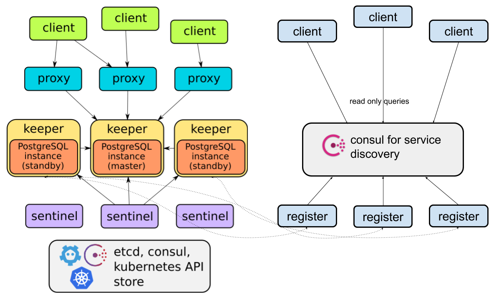

## Service Discovery

Service discovery helps in discovering stolon standby keepers for performing readonly queries

`register` watches the keeper and registers them in `consul` for service discovery.

`clients` which want to do readonly query can find the standby keepers by querying `consul`

> use `--register-master` flag to register master for performing readonly queries, don't use it for write queries, always use `proxy` to connect to master, refer [here](./faq.md#why-clients-should-use-the-stolon-proxy) for more info