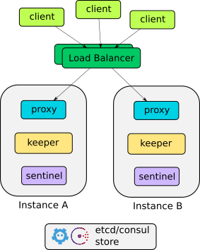
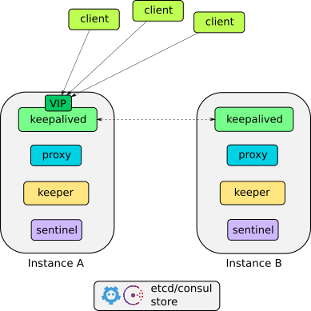

# Two (or more) nodes setup example

If you're going to run stolon on an IaaS or any kind of two nodes (baremetal, VM) this document provides some example configurations. These examples provide a two nodes setup that can be extended to a number greater than two nodes.

The related store should live outside the instances hosting the stolon cluster for multiple reasons:

* Stores like etcd/consul uses the raft consensus protocol that requires at least 3 nodes to provides high availability (it can survive to the death of (N/2)-1 members)
* Disk I/O of postgres must not impact the etcd/consul I/O
* You can run multiple stolon clusters using the same store

# Two nodes with load balancer

Every nodes will run one keeper, one sentinel and one proxy.

The load balancer will balance between the stolon proxies.

Clients will connect to the load balancer VIP.

# Two nodes with keepalived

Every nodes will run one keeper, one sentinel and one proxy.

Every nodes also runs a [keepalived](http://www.keepalived.org/) instance that will mantain a VIP assigned to one of the nodes. If one of the nodes dies/become partitioned keepealived will switch the VIP to the other node.

Clients will connect to the VIP managed by keepalived.
